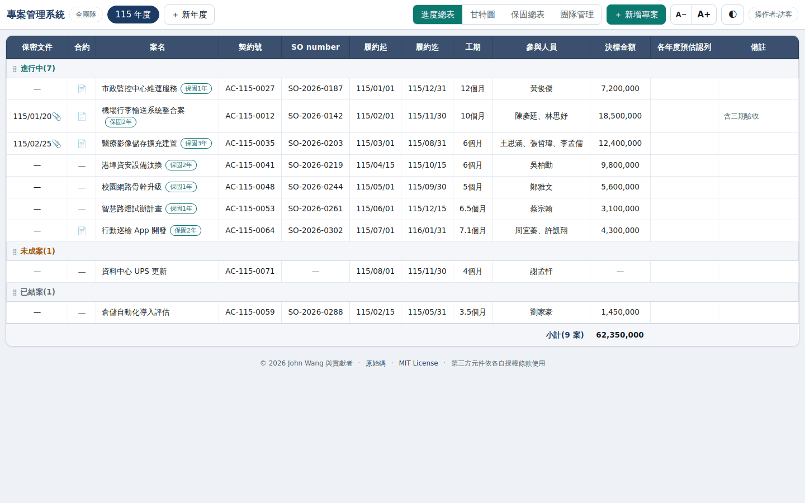
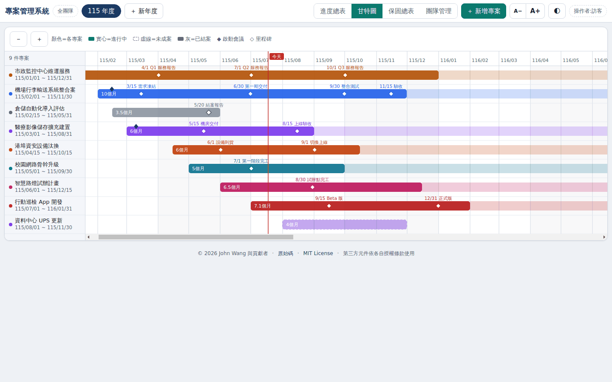
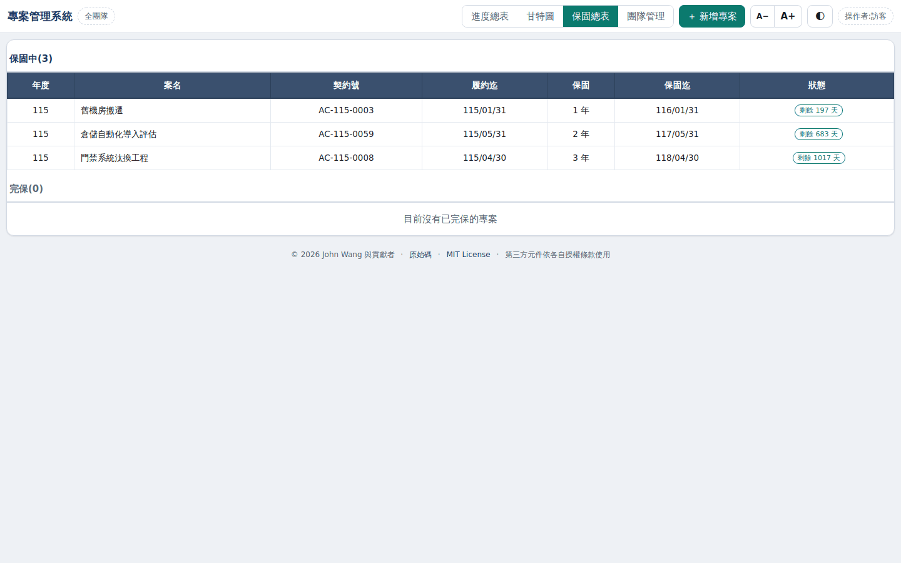
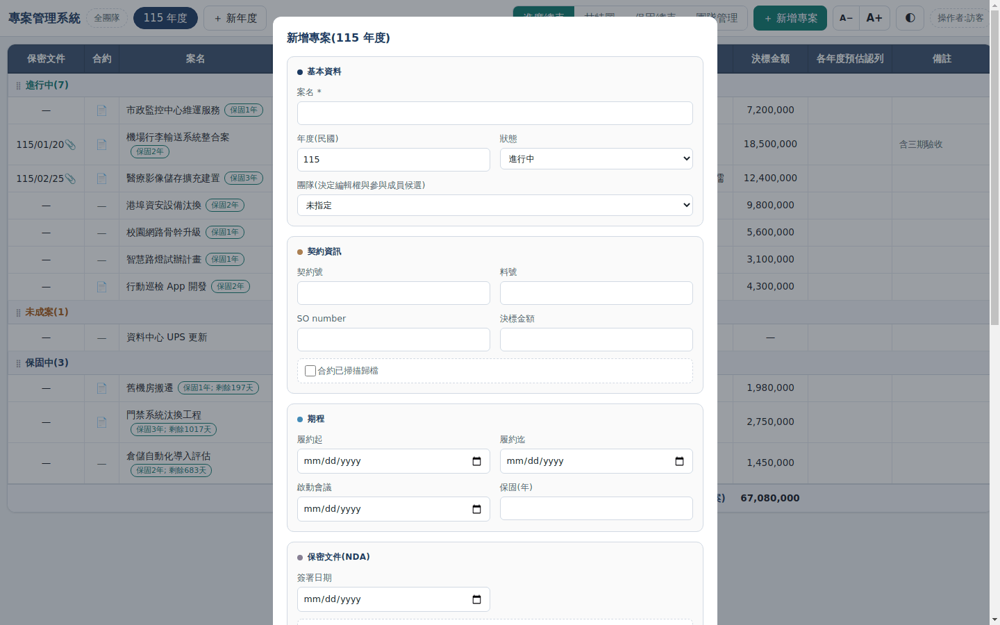
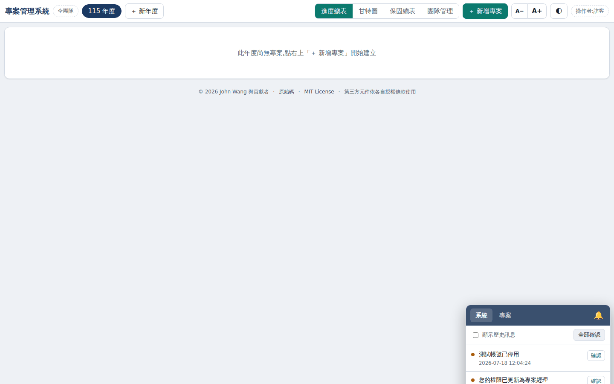

# 專案期程預算管理系統

一套以網頁取代人工維護「專案期程、預算總表與甘特圖」的輕量化管理系統。

系統支援多人即時檢視、Google 帳號登入、團隊資料隔離、角色與欄位級權限、專案期程追蹤、預算認列、保固管理、通知及異動稽核。

系統有兩種部署形態，共用同一份程式碼：

| | 線上版 | 單機版 |
|---|---|---|
| 用途 | 多人協作 | 單機離線使用 |
| 部署 | GitHub Pages + Render | 一台 Windows 電腦 |
| 啟用方式 | 預設 | 單一執行檔（`PM_MODE=standalone`） |
| 需要網路 | 是 | **完全不需要** |
| 安裝 | 無（開網頁即可） | 無（點兩下執行檔即可，不必安裝 Python） |

單機版的取得與使用請參閱 [`standalone/README-standalone.md`](standalone/README-standalone.md)。

## 系統畫面

> 以下畫面中的專案、契約號、金額與人名皆為示範用的虛構資料。

### 進度總表

一個年度一頁。專案依狀態分組（進行中／未成案／已結案），欄位涵蓋契約號、SO number、
履約起迄、工期、參與人員、決標金額與各年度預估認列。日期以民國年顯示。



### 甘特圖

同一批資料自動產生期程圖，不需另外維護。虛線為未成案、灰色為已結案，
里程碑標在各專案的時間軸上。



### 保固總表

履約結束後自動進入保固追蹤，依保固年數推算保固迄日，區分保固中與已完保。



### 專案編輯

單一表單維護基本資料、契約資訊、里程碑、跨年度預算認列與通知設定。



### 訊息提醒

畫面上有一顆可拖曳的鈴鐺浮動按鈕（位置會記住）。系統發出的提醒——里程碑到期、
專案結案、註冊審核、權限異動等——都納管在這裡，依系統／專案分頁。有未確認訊息時
鈴鐺會閃爍光暈並循環播放提示音（可靜音），確認後自動隱藏，全部確認才停止閃爍。
可切換顯示歷史訊息。

線上版的提醒同時寄送 email；單機版沒有 email，鈴鐺就是它唯一的主動提醒管道。
每位使用者各自有已讀狀態——管理者看得到全部提醒，其他人只看與自己相關的。



## 專案狀態

本專案為開放原始碼專案，採用 [MIT License](LICENSE) 授權。

原始碼可依 MIT License 自由使用、修改、散布及商業使用。使用或散布本專案時，應保留原著作權與授權聲明。

本 Repository 僅包含系統程式碼、文件與示範結構，不包含正式環境中的：

- 公司專案或預算資料
- SQLite 正式資料庫
- Google OAuth 憑證
- JWT 密鑰
- Google Refresh Token
- Gmail 或 Google Drive 存取憑證
- 其他個人資料或公司機密

## 作者與維護者

原始作者：**John Wang (`fantasy1164`)**

Copyright © 2026 John Wang and contributors.

作者資訊亦放置於前端部署目錄的 [`frontend/humans.txt`](frontend/humans.txt)。第三方套件與服務的著作權、商標及其他權利仍歸各自權利人所有。

## 功能特色

- 年度專案進度總表
- 自動產生甘特圖
- 保固專案總表
- 專案里程碑管理
- 跨年度預算認列
- 團隊與分包關係管理
- Google 帳號登入
- JWT Session 驗證
- 管理者、專案經理、部門主管、業務及開發人員角色
- 欄位級可見、唯讀與可寫權限
- 團隊資料隔離
- 異動稽核紀錄
- 系統及專案通知設定
- Gmail 通知
- 可拖曳的鈴鐺提醒：未確認訊息閃爍光暈＋循環提示音，每人各自已讀狀態
- Google Drive 版本化資料庫備份
- 深色與淺色主題
- 響應式桌面及行動裝置介面
- 線上多人版與離線單機版共用同一套程式碼
- 單機版打包為單一執行檔：免安裝 Python、點兩下即用、系統匣常駐

## 系統架構

```text
使用者瀏覽器
    │
    │ Google Sign-In / Google ID Token
    ▼
GitHub Pages
frontend/index.html
    │
    │ HTTPS / JSON / JWT
    ▼
Render Web Service
Flask API + Gunicorn
    │
    ├── SQLite
    │   └── 系統工作資料庫
    │
    ├── Google Drive API
    │   └── 版本化資料庫備份與開機還原
    │
    └── Gmail API
        └── 系統通知信件
```

正式環境的工作資料庫位於 Render 執行環境，Google Drive 版本化快照則作為資料持久化與還原來源。

系統啟動時會先還原最新可用的資料庫快照。若還原失敗，服務將維持不可用狀態並回傳 HTTP 503，不會靜默建立空白資料庫對外服務。

### 單機版架構

設定 `PM_MODE=standalone` 後，同一份程式碼會以單一行程、完全離線的形態運作：

```text
使用者瀏覽器
    │
    │ HTTP / JSON （同源，不需 CORS，不需登入）
    ▼
Flask + Waitress （127.0.0.1，僅綁本機）
    │
    ├── frontend/index.html
    │   └── 由後端直接服務，前端因此改用相對路徑 /api
    │
    ├── SQLite
    │   └── %LOCALAPPDATA%\專案管理系統\data\pm.sqlite （唯一真實資料來源）
    │
    └── 本機資料夾
        └── %LOCALAPPDATA%\專案管理系統\backups\ 版本化快照
```

單機版以單一執行檔散布（PyInstaller onefile）。執行檔內含 Python 直譯器與全部相依，
使用者不需要安裝任何東西；**資料則固定存放於 `%LOCALAPPDATA%\專案管理系統\`，
與執行檔完全脫鉤** —— 執行檔可以隨意擺放、刪除或換新版，資料不受影響。

以原始碼執行時（`standalone/start.bat`）資料仍在 `standalone/data/`，行為與早期版本一致。

單機版不連線任何外部服務：不做 Google 登入、不呼叫 Google Drive API、不寄送 Gmail。

與線上版的關鍵差異在於**開機不還原快照**。線上版的 Render 磁碟是暫時的，資料庫必須從快照還原；單機版的資料庫就在使用者硬碟上，是唯一真實來源，開機還原反而會覆蓋掉使用者上次的編輯。因此兩者由不同的旗標控制（`PM_RESTORE_ON_BOOT` 與 `PM_SYNC_ENABLED`），單機版只保留備份，還原改為使用者主動執行。

## 技術架構

| 層級 | 技術 |
|---|---|
| 前端 | HTML、CSS、原生 JavaScript |
| 後端 | Python 3.12、Flask |
| 資料庫 | SQLite |
| 正式 WSGI Server | Gunicorn |
| 單機版 WSGI Server | Waitress |
| 登入 | Google Identity Services |
| Google Token 驗證 | google-auth |
| 系統 Session | PyJWT |
| API 限流 | Flask-Limiter |
| HTTP Client | Requests |
| Proxy Header 處理 | Werkzeug ProxyFix |
| 前端部署 | GitHub Pages |
| 後端部署 | Render |
| 備份 | Google Drive API |
| 通知 | Gmail API |

前端未使用 npm、React、Vue、Angular 或其他 JavaScript Framework。

## 開源套件

本專案直接使用下列開源套件：

| 套件 | 用途 | 授權 |
|---|---|---|
| Flask | Web API Framework | BSD-3-Clause |
| Flask-Limiter | API Rate Limiting | MIT |
| Requests | HTTP Client | Apache-2.0 |
| Gunicorn | WSGI HTTP Server（線上版） | MIT |
| Waitress | WSGI HTTP Server（單機版） | ZPL 2.1 |
| PyJWT | JWT 編碼與驗證 | MIT |
| google-auth | Google ID Token 驗證 | Apache-2.0 |
| Werkzeug | WSGI 工具與 ProxyFix | BSD-3-Clause |

單機版的執行檔另外內含 Python 直譯器（PSF-2.0）、Tcl/Tk（BSD 類，啟動動畫用）、
SQLite（公有領域）與 PyInstaller 的 bootloader（GPL-2.0，**含 Bootloader Exception**，
明確允許嵌入並散布，不對本專案產生 GPL 限制）。

**執行檔內不含任何 copyleft 元件**：系統匣圖示以 Python 標準庫的 ctypes 直接呼叫
Win32 API 實作（`standalone/tray_win32.py`），而非採用 LGPL 授權的 pystray；
Google 與 HTTP 相關套件在單機版用不到，已排除於打包之外，連帶排除了 MPL-2.0 的 certifi。

各第三方元件仍由其原作者或權利人持有著作權，並依各自的授權條款使用。

詳見 [`THIRD_PARTY_NOTICES.md`](THIRD_PARTY_NOTICES.md)。

## 第三方服務

本系統可與下列外部服務整合：

- Google Identity Services
- Google OAuth
- Google Drive API
- Gmail API
- GitHub Pages
- Render

這些服務不是本專案所有，其使用方式、可用性、商標、費率、配額及服務條款均由各服務提供者決定。

部署者應自行申請帳號、建立憑證，並遵守相應的服務條款及資料保護規範。

## 安全模型

系統以「後端為唯一授權權威」為原則。

前端所做的按鈕隱藏、欄位遮罩及畫面限制，只是使用者介面控制，不是安全邊界。所有資料讀取、修改、刪除及管理操作都必須由後端重新驗證。

主要安全設計包括：

- Google ID Token 驗簽及 Audience 檢查
- 系統 JWT 簽發與到期驗證
- JWT 僅保存使用者識別碼
- 每次請求重新查詢資料庫中的角色與權限
- 團隊資料隔離
- 專案級與欄位級存取控制
- SQL 參數化查詢
- 可寫入欄位白名單
- 使用者字串輸出跳脫
- CORS 來源限制
- API Rate Limiting
- 外部通知端點 Token 保護
- 機密資訊使用環境變數管理
- 正式環境預設停用 Flask Debug Mode
- 資料庫完整性檢查
- 版本化備份及還原失敗保護

### 單機版的安全模型

單機版沒有登入，也沒有權限控管。任何能操作該台電腦的人都可以讀寫全部資料。

這是單機版的設計前提，不是缺陷。它的保護邊界是**作業系統帳號與該台電腦本身**，而不是應用程式。服務只綁定 `127.0.0.1`，不對區域網路開放。

需要多人協作、身分驗證或權限控管時，應使用線上版。

本專案不保證部署後自動符合任何特定公司的資安政策、ISO 27001、個資法、GDPR 或其他法令及標準。部署者應依實際環境自行完成安全審查與設定。

## 權限與角色

以下僅適用於線上版。單機版不啟用登入，因此沒有使用者、角色與權限矩陣。

| 角色 | 說明 |
|---|---|
| `admin` | 系統管理者 |
| `pm` | 專案經理 |
| `dept_head` | 部門主管 |
| `sales` | 業務人員 |
| `dev` | 開發人員 |

帳號狀態：

| 狀態 | 說明 |
|---|---|
| `pending` | 等待管理者核准 |
| `active` | 已啟用 |
| `disabled` | 已停用 |

管理者可以設定不同角色對各類欄位的權限：

- `invisible`：不可見
- `readonly`：唯讀
- `writable`：可編輯

一般使用者只能檢視自己所屬團隊，以及分包給該團隊的專案。

## 主要資料表

| 資料表 | 用途 |
|---|---|
| `users` | 使用者、角色、狀態及通知信箱 |
| `projects` | 專案主檔 |
| `teams` | 團隊資料 |
| `team_members` | 團隊成員及團隊內角色 |
| `milestones` | 專案里程碑 |
| `budget_allocations` | 各年度預估認列 |
| `project_members` | 專案參與人員 |
| `project_subcontracts` | 主包與分包團隊關係 |
| `project_team_overrides` | 分包團隊的獨立欄位資料 |
| `field_perms` | 角色與欄位權限矩陣 |
| `team_notify_matrix` | 團隊通知矩陣 |
| `notifications` | 通知歷史 |
| `app_settings` | 系統設定 |
| `audit_log` | 異動稽核紀錄 |

## 專案結構

```text
pm-system/
├── backend/
│   ├── app.py
│   ├── auth_core.py
│   ├── config.py          # 線上／單機模式的設定唯一來源
│   ├── persistence.py
│   ├── mailer.py
│   ├── schema.sql
│   ├── seed_demo.py
│   ├── test_modes.py      # 模式回歸測試
│   ├── requirements.txt
│   ├── gunicorn.conf.py
│   └── wsgi.py
├── frontend/
│   ├── index.html
│   └── humans.txt
├── standalone/            # 單機版（線上部署不會用到此目錄）
│   ├── install.bat
│   ├── install.py
│   ├── start.bat
│   ├── serve.py           # 啟動器：模式、換 port、開瀏覽器、啟動動畫、系統匣
│   ├── tray_win32.py      # 系統匣圖示（ctypes 直接呼叫 Win32，不引入 copyleft）
│   ├── requirements.txt
│   ├── README-standalone.md
│   ├── build/             # 打包成單一 exe 的材料
│   │   ├── build.bat      # 開發者用：在本機打包
│   │   ├── build.py
│   │   ├── pm.spec        # PyInstaller 規格
│   │   ├── version_info.txt
│   │   ├── make_icon.py   # 產生 app.ico
│   │   ├── make_splash.py # 產生啟動動畫的逐格圖
│   │   ├── app.ico
│   │   └── splash_00..07.png
│   ├── data/              # 使用者資料庫（不進 Git；exe 版改用 %LOCALAPPDATA%）
│   └── backups/           # 本機版本化快照（不進 Git）
├── docs/
│   └── screenshots/       # README 用的系統畫面
├── .github/
│   └── workflows/
│       ├── deploy-pages.yml       # 前端部署到 GitHub Pages
│       └── build-standalone.yml   # 打包單機版 exe（手動觸發或打 tag）
├── .gitattributes
├── DEPLOY.md
├── render.yaml
├── THIRD_PARTY_NOTICES.md
├── LICENSE
└── README.md
```

## 本機開發

### 系統需求

- Python 3.12
- Git
- 現代瀏覽器

### 啟動後端

Windows PowerShell：

```powershell
cd backend

python -m venv .venv
. .venv\Scripts\activate

python -m pip install --upgrade pip
pip install -r requirements.txt

python seed_demo.py
python app.py
```

macOS 或 Linux：

```bash
cd backend

python3 -m venv .venv
source .venv/bin/activate

python -m pip install --upgrade pip
pip install -r requirements.txt

python seed_demo.py
python app.py
```

後端預設網址：`http://127.0.0.1:5000`

### 啟動前端

另開一個終端：

```powershell
cd frontend
python -m http.server 8080
```

前端網址：`http://localhost:8080`

前端會依實際情況決定 API 位址，依序判斷：

| 情況 | API 位址 |
|---|---|
| `localStorage.pm_api` 有值 | 該值（手動覆寫，供除錯） |
| 頁面由後端服務（單機版） | `/api`（同源相對路徑） |
| 從 GitHub Pages 開啟 | `index.html` 中設定的 `PROD_API` |
| 其他（本機開發、直接開檔） | `http://127.0.0.1:5000/api` |

「頁面由後端服務」是後端在回應 HTML 時注入一個旗標判定的，磁碟上的 `index.html` 不含該旗標。因此 GitHub Pages 取得的仍是原始檔案，前端得以維持單一份程式碼，且判斷結果與後端使用哪個 port 無關。

## 環境變數

所有密鑰、Token、帳號資料及正式環境識別資訊都不得提交至 Git。

模式相關的旗標集中在 [`backend/config.py`](backend/config.py) 判讀。`PM_MODE` 未設定時，各變數的行為與本檔導入前完全相同。

例外是 `GOOGLE_CLIENT_*`、`GOOGLE_REFRESH_TOKEN`、`PM_DRIVE_FOLDER_ID` 及 `PM_MAIL_FROM_*`：這些由 `persistence.py` 與 `mailer.py` 中的 Google 專屬類別直接讀取。單機版不會建立這些類別（`PM_DRIVE_MODE` 被強制為 `local`，寄信另有防呆攔阻），因此不影響離線性質。

### 執行模式

| 變數 | 必填 | 說明 |
|---|---|---|
| `PM_MODE` | 否 | `online`（預設）或 `standalone` |
| `PM_SERVE_FRONTEND` | 否 | 設為 `1` 由後端服務 `frontend/`；單機版預設開啟 |
| `PM_RESTORE_ON_BOOT` | 否 | 開機是否從快照還原；預設同 `PM_SYNC_ENABLED` |

`PM_MODE=standalone` 會強制關閉所有需要聯網的功能（Google 登入、Drive 備份、Gmail 通知），**且不受其他環境變數覆寫**。即使設定 `PM_AUTH_ENABLED=1`，單機模式仍不啟用登入。這是刻意的：單機版的離線性質不應被誤設的環境變數破壞。

`PM_MODE` 只接受這兩個值，打錯字會拒絕啟動，不會靜默跑成非預期的模式。

### 登入與驗證

| 變數 | 必填 | 說明 |
|---|---|---|
| `PM_AUTH_ENABLED` | 正式環境必填 | 設為 `1` 啟用登入 |
| `PM_JWT_SECRET` | 是，機密 | JWT 簽章密鑰 |
| `GOOGLE_OAUTH_CLIENT_ID` | 是 | Google 網頁應用程式 OAuth Client ID |
| `PM_ADMIN_EMAIL` | 是，機密 | 初始管理者 Google 帳號 |
| `PM_AUTH_TEST_MODE` | 否 | 測試模式，正式環境不得啟用 |

### CORS

| 變數 | 必填 | 說明 |
|---|---|---|
| `PM_CORS_ORIGIN` | 建議必填 | 允許的前端來源，可使用逗號分隔 |

未設定 `PM_CORS_ORIGIN` 時，後端不會自動允許任意跨來源請求。

### Google Drive 備份

| 變數 | 必填 | 說明 |
|---|---|---|
| `PM_SYNC_ENABLED` | 正式環境必填 | 設為 `1` 啟用備份 |
| `PM_RESTORE_ON_BOOT` | 否 | 開機是否從快照還原；預設同 `PM_SYNC_ENABLED` |
| `PM_DRIVE_MODE` | 是 | `google` 或 `local` |
| `GOOGLE_CLIENT_ID` | Google 模式必填 | Google OAuth Client ID |
| `GOOGLE_CLIENT_SECRET` | Google 模式必填，機密 | Google OAuth Client Secret |
| `GOOGLE_REFRESH_TOKEN` | Google 模式必填，機密 | Google OAuth Refresh Token |
| `PM_DRIVE_FOLDER_ID` | Google 模式必填 | Google Drive 備份資料夾 ID |
| `PM_BOOTSTRAP` | 僅首次部署 | 允許無備份時初始化空白資料庫 |
| `PM_BACKUP_DEBOUNCE` | 否 | 寫入後延遲備份秒數 |
| `PM_BACKUP_KEEP` | 否 | 保留備份數量 |
| `PM_DB_PATH` | 否 | SQLite 資料庫路徑 |

`PM_BOOTSTRAP=1` 僅可用於第一次部署。第一次成功備份後應立即移除。

備份與開機還原是兩個獨立的旗標。線上版兩者同時啟用；單機版只啟用備份，開機不還原（硬碟上的資料庫才是唯一真實來源）。

### Gmail 通知

| 變數 | 必填 | 說明 |
|---|---|---|
| `PM_NOTIFY_TOKEN` | 建議必填，機密 | 保護外部通知掃描端點 |
| `PM_NOTIFY_DRYRUN` | 否 | `1` 表示只掃描不寄信 |
| `PM_MAIL_FROM_ADDR` | 否 | 寄件帳號 |
| `PM_MAIL_FROM_NAME` | 否 | 寄件者顯示名稱 |

### 開發環境

| 變數 | 說明 |
|---|---|
| `PM_DEBUG` | 設為 `1` 啟用 Flask Debug，僅限本機 |
| `PM_LOCAL_DRIVE_DIR` | Local Drive 模式使用的本機資料夾 |

### 單機版

單機版不需要設定任何環境變數，`start.bat` 會處理。以下僅供調整用：

| 變數 | 說明 |
|---|---|
| `PM_PORT` | 指定 port（預設 5000，被佔用時自動往後尋找） |
| `PM_NO_BROWSER` | 設為 `1` 啟動時不自動開啟瀏覽器 |
| `PM_DB_PATH` | 資料庫路徑（預設 `standalone/data/pm.sqlite`） |
| `PM_LOCAL_DRIVE_DIR` | 備份資料夾（預設 `standalone/backups/`） |

## API 概要

### 系統與登入

| 方法 | 路徑 | 說明 |
|---|---|---|
| GET | `/api/health` | 系統健康與還原狀態 |
| POST | `/api/auth/google` | Google 登入 |
| POST | `/api/auth/register` | 新使用者註冊 |
| GET | `/api/auth/config` | 前端登入設定 |
| GET | `/api/auth/me` | 目前使用者及權限 |

### 專案

| 方法 | 路徑 | 說明 |
|---|---|---|
| GET | `/api/years` | 年度清單 |
| GET | `/api/projects` | 專案清單 |
| GET | `/api/projects/{id}` | 單一專案 |
| POST | `/api/projects` | 新增專案 |
| PUT | `/api/projects/{id}` | 更新專案 |
| DELETE | `/api/projects/{id}` | 軟刪除專案 |
| POST | `/api/years/{year}/init` | 建立新年度 |

### 團隊、通知與稽核

| 方法 | 路徑 | 說明 |
|---|---|---|
| GET / POST | `/api/teams` | 查詢或建立團隊 |
| GET / PUT / DELETE | `/api/users` | 使用者管理 |
| GET / PUT | `/api/perms` | 欄位權限矩陣 |
| GET / PUT | `/api/projects/{id}/subcontracts` | 分包關係 |
| GET / PUT | `/api/notify/system` | 系統通知設定 |
| GET / PUT | `/api/notify/matrix/{team_id}` | 團隊通知矩陣 |
| GET / DELETE | `/api/notify/history` | 通知歷史 |
| POST | `/api/notify/run` | 執行通知掃描 |
| GET | `/api/audit` | 異動稽核紀錄 |

實際權限及完整輸入輸出格式以後端程式碼為準。

## 部署

詳細部署方式請參閱 [`DEPLOY.md`](DEPLOY.md)。

建議部署順序：

1. 建立 Google OAuth 憑證。
2. 建立 Google Drive 備份資料夾。
3. 將 Repository 連接至 Render Blueprint。
4. 設定 Render 環境變數。
5. 第一次部署時暫時設定 `PM_BOOTSTRAP=1`。
6. 建立第一筆資料並確認 Google Drive 備份成功。
7. 移除 `PM_BOOTSTRAP`。
8. 啟用 GitHub Pages。
9. 設定 Google OAuth Authorized JavaScript Origins。
10. 收斂 `PM_CORS_ORIGIN` 至正式前端網域。

### 單機版

單機版不需要上述任何步驟，也不需要 Google 憑證、Render 或 GitHub Pages：

1. 安裝 Python 3.12（勾選 Add Python to PATH）。
2. 取得本專案原始碼。
3. 執行 `standalone/install.bat`（僅此步驟需要網路）。
4. 執行 `standalone/start.bat`。

詳見 [`standalone/README-standalone.md`](standalone/README-standalone.md)。

### 更新

線上版與單機版共用同一份程式碼，推送至 `main` 後：

- 前端有異動時 GitHub Pages 自動發布，後端有異動時 Render 自動部署。
- 單機版執行 `git pull` 後重新啟動 `start.bat` 即完成更新；使用者資料位於 `standalone/data/`，不受更新影響。

新增功能若本質上需要聯網，應於 `backend/config.py` 的 standalone 區塊將其關閉，並以 `backend/test_modes.py` 驗證。

## 資料與隱私

MIT License 適用於本 Repository 中由本專案作者及貢獻者提供的程式碼與文件。

MIT License 不會自動授權：

- 使用者自行輸入的專案資料
- 公司預算及合約資料
- 個人資料
- 商業機密
- OAuth 憑證或 Token
- 第三方商標
- 第三方套件本身的著作權
- Google、GitHub、Render 或其他服務的商標及服務內容

部署者應負責保護資料庫與備份、管理帳號與權限、妥善保存密鑰、定期更新依賴，並評估適用的個資、資安及法令要求。

## 貢獻

歡迎透過 Issue 或 Pull Request 提出錯誤修正、安全改善、文件更新、測試或新功能建議。

除非另有書面約定，提交至本專案的程式碼貢獻，視為同意依本專案相同的 MIT License 提供。貢獻者仍保有其原始貢獻的著作權。

## 安全性問題

請勿在公開 Issue 中張貼真實帳號、Access Token、Refresh Token、OAuth Client Secret、JWT Secret、正式資料庫、公司機密資料或可直接利用的未修補弱點細節。

發現安全性問題時，請透過 GitHub 的私人安全回報機制，或以非公開方式聯絡維護者。

## 授權

本專案採用 MIT License，完整授權內容請參閱 [`LICENSE`](LICENSE)。

## 免責聲明

本軟體依「現況」提供，不附帶任何明示或默示擔保，包括但不限於適售性、特定目的適用性、資料完整性、資料不遺失、服務不中斷、資安合規或法令合規。

作者及貢獻者不對因使用、部署、修改或無法使用本軟體所產生的任何直接或間接損失負責。
